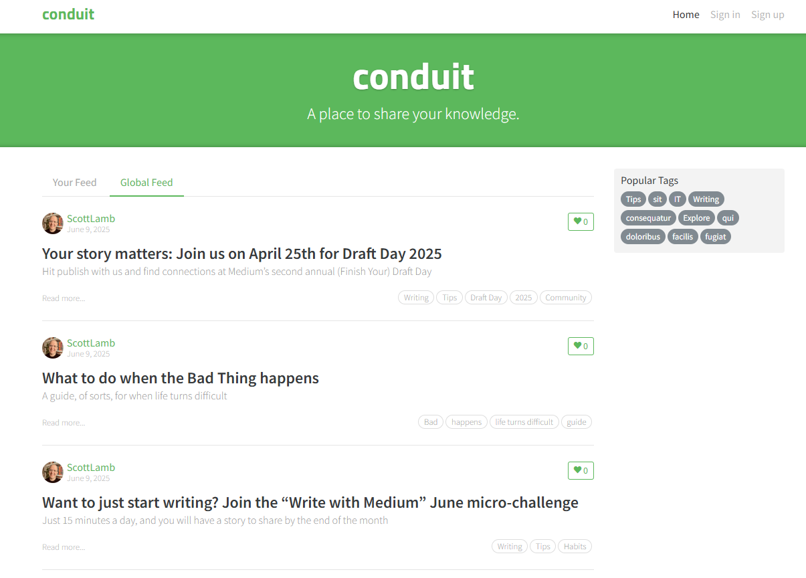

# 

# پروژه RealWorld - پیاده‌سازی با React و Vite

  
_یک اپلیکیشن کامل بر اساس داکیومنت RealWorld با استفاده از React، Vite به همراه بک اند توصیه شده در داکیومنت [Node/Express/Prisma]_

## فهرست مطالب

- [معرفی پروژه](#معرفی-پروژه)
- [ویژگی‌ها](#ویژگی‌ها)
- [تکنولوژی‌های استفاده‌شده](#تکنولوژی‌های-استفاده‌شده)
- [نصب و راه‌اندازی](#نصب-و-راه‌اندازی)
  - [پیش‌نیازها](#پیش‌نیازها)
  - [نصب](#نصب)
  - [اجرای پروژه](#اجرای-پروژه)
- [ساختار پروژه](#ساختار-پروژه)
- [اتصال به API](#اتصال-به-api)
- [تصاویر پروژه](#تصاویر-پروژه)
- [چالش‌ها و راه‌حل‌ها](#چالش‌ها-و-راه‌حل‌ها)
- [مشارکت](#مشارکت)
- [لایسنس](#لایسنس)
- [تماس](#تماس)
- [نسخه انگلیسی](#نسخه-انگلیسی)

## معرفی پروژه

این پروژه پیاده‌سازی کامل [RealWorld](https://github.com/gothinkster/realworld) است طبق مستندات و استاندارد های اعلام شده است که یک پلتفرم وبلاگ‌نویسی مشابه Medium را شبیه‌سازی می‌کند. این اپلیکیشن شامل قابلیت‌های احراز هویت کاربر، مدیریت مقالات و ویژگی‌های اجتماعی است. فرانت‌اند با **React** و **Vite** ساخته شده تا تجربه توسعه سریع و بهینه‌ای ارائه دهد، و بک‌اند از نمونه آماده [Node (Express + Prisma)](https://github.com/gothinkster/node-express-realworld-example-app) از مخزن RealWorld استفاده می‌کند. این پروژه به‌عنوان نمونه‌کار من طراحی شده تا مهارت‌هایم در توسعه وب مدرن، کار با API و کدنویسی تمیز را نشان دهد.

## ویژگی‌ها

- **احراز هویت کاربر:** ثبت‌نام، ورود و خروج با استفاده از JWT.
- **مدیریت مقالات:** ایجاد، ویرایش، حذف و لایک کردن مقالات.
- **پروفایل کاربر:** نمایش پروفایل کاربران و مقالات منتشرشده آن‌ها.
- **فید مقالات:** نمایش فید عمومی و شخصی‌سازی‌شده مقالات.
- **طراحی ریسپانسیو:** تمامی کد های داکیومنت مورد استفاده قرار گرفته و ریسپانسیو سازی شده
- **تجربه توسعه سریع:** استفاده از Vite برای بیلد سریع و Hot Module Replacement (HMR).

## تکنولوژی‌های استفاده‌شده

- **فرانت‌اند:**

  - **کتابخانه React** برای ساخت رابط کاربری به صورت PWA
  - **Vite:** ابزار مدرن برای بیلد سریع و توسعه
  - طبق Css های ارائه شده توسط داکیومنت پروژه: برای استایل‌دهی اپلیکیشن

- **ابزارهای دیگر:**

  - استفاده از Git جهت کنترل ورژن ها
  - Prettier : جهت فرمت دهی بهتر کد ها
  - React Router : جهت روتینگ بهینه پروژه
  - React Form Control و YUP : جهت ساده سازی و جمع آوری بهتر اطلاعات فرم ها و ولیدیشن بهینه تر

## نصب و راه‌اندازی

### پیش‌نیازها

قبل از شروع، اطمینان حاصل کنید که موارد زیر نصب شده‌اند:

- Node.js (نسخه 16 یا بالاتر)
- npm
- Git
- Postger , PdAdmin 4

### نصب

1. **کلون کردن مخزن:**

   ```bash
   git clone https://github.com/Crazynooi3/RealWorld-React.git
   cd RealWorld-React
   ```

2. **نصب وابستگی‌های فرانت‌اند:**

   ```bash
   cd Realworld-React
   npm install
   ```

3. **نصب وابستگی‌های بک‌اند:**
   ```bash
   cd Realworld-React/backend
   npm install
   ```

### اجرای پروژه

1. **راه‌اندازی سرور بک‌اند:**

   ```bash
   cd Realworld-React/backend
   NPM Start
   ```

   سرور بک‌اند روی `http://localhost:[پورت بک‌اند, مثلاً 3000 یا 8000]` اجرا می‌شود.

2. **راه‌اندازی سرور توسعه فرانت‌اند:**

   ```bash
   cd Realworld-React
   npm run dev
   ```

   فرانت‌اند روی `http://localhost:5173` (پورت پیش‌فرض Vite) اجرا می‌شود.

3. مرورگر را باز کنید و به `http://localhost:5173` بروید تا اپلیکیشن را ببینید.

## ساختار پروژه

```
├── Realworld-React/             # فرانت‌اند React + Vite
│   ├── src/
│   │   ├── components/         # کامپوننت‌های قابل استفاده مجدد
│   │   ├── pages/              # کامپوننت‌های صفحات (مثل Home، Article، Profile)
│   │   ├── assets/             # فایل‌های استاتیک (تصاویر، استایل‌ها)
│   │   ├── App.jsx             # کامپوننت اصلی اپلیکیشن
│   │   └── main.jsx            # نقطه ورود
├── backend/                     # پیاده‌سازی بک‌اند
│   ├── [فایل‌های مربوط به بک‌اند] # مثلاً server.js، models/، routes/
├── README.md                    # مستندات پروژه
└── .gitignore                   # فایل‌های نادیده‌گرفته‌شده توسط Git
```

## اتصال به API

فرانت‌اند از طریق مشخصات [RealWorld API](https://github.com/gothinkster/realworld/tree/main/api) با بک‌اند ارتباط برقرار می‌کند. برخی از endpointهای کلیدی:

- **POST /api/users**: ثبت‌نام کاربر جدید.
- **POST /api/users/login**: ورود کاربر.
- **GET /api/articles**: دریافت فید عمومی مقالات.
- **POST /api/articles**: ایجاد مقاله جدید.

برای مدیریت درخواست‌های API از Axios استفاده شده و حالات لودینگ و خطاها برای تجربه کاربری بهتر پیاده‌سازی شده‌اند.

## تصاویر پروژه

| صفحه اصلی                                                            | صفحه مقاله                                                        | پروفایل کاربر                                                          |
| -------------------------------------------------------------------- | ----------------------------------------------------------------- | ---------------------------------------------------------------------- |
|  |  |  |

_توجه: تصاویر placeholder را با اسکرین‌شات‌های واقعی پروژه جایگزین کنید._

## چالش‌ها و راه‌حل‌ها

- **چالش:** مدیریت درخواست‌های ناهمزمان API و نمایش حالات لودینگ.
  - **راه‌حل:** استفاده از هوک‌های `useState` و `useEffect` در React به همراه Axios برای مدیریت داده‌ها و نمایش اسپینرهای لودینگ.
- **چالش:** ایجاد طراحی ریسپانسیو برای دستگاه‌های مختلف.
  - **راه‌حل:** استفاده از [CSS Framework یا CSS Grid/Flexbox] برای ساخت رابط کاربری مناسب موبایل.
- **چالش:** اتصال به API بک‌اند RealWorld.
  - **راه‌حل:** رعایت دقیق مشخصات API و استفاده از متغیرهای محیطی برای مدیریت آدرس‌های API.

## مشارکت

از مشارکت شما استقبال می‌شود! برای همکاری:

1. مخزن را فورک کنید.
2. شاخه جدید بسازید (`git checkout -b feature/ویژگی-شما`).
3. تغییرات را کامیت کنید (`git commit -m 'اضافه کردن ویژگی'`).
4. شاخه را push کنید (`git push origin feature/ویژگی-شما`).
5. Pull Request باز کنید.

## لایسنس

این پروژه تحت لایسنس MIT منتشر شده است. جزئیات را در فایل [LICENSE](LICENSE) ببینید.

## تماس

برای سؤالات یا بازخورد با من تماس بگیرید:

- GitHub: [نام کاربری GitHub شما](https://github.com/[نام کاربری GitHub شما])
- ایمیل: [ایمیل شما]
- لینکدین: [پروفایل لینکدین شما]

## نسخه انگلیسی

این مستند به‌زودی به انگلیسی در فایل [README_en.md](README_en.md) در دسترس خواهد بود.  
_برای تغییر زبان به انگلیسی، به فایل README_en.md مراجعه کنید (پس از آماده‌سازی)._

_ساخته‌شده با 💻 و ☕ توسط [نام شما]._
